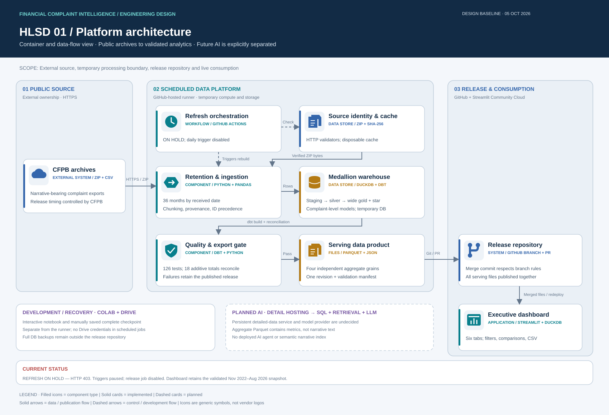

# Financial Complaint Intelligence

A CFPB complaint analytics platform with a six-tab executive dashboard, a tested rolling-refresh implementation, and a planned evidence-backed AI agent.

## Problem statement
Financial-services leadership needs a reliable way to identify changing complaint patterns and investigate the customer experiences behind them. This project prepares consistent complaint metrics and narrative evidence for a dashboard and a data agent that can answer questions using SQL calculations and cited complaint records.

The intended decisions are which complaint categories need investigation, where volumes are changing, and how recorded response outcomes differ. Public complaints cannot establish internal root causes, customer satisfaction, company-wide incident rates or financial losses.

## Historical full-data validation
| Measure | Result |
|---|---:|
| Selected archive exports | 18 |
| Unique complaints | 14,482,997 |
| Published narratives | 2,711,935 |
| Observed received dates | 2022-11-01 to 2026-08-31 |
| Bronze Parquet files | 299 |
| Bronze Parquet size | Approximately 733 MB |
| Silver tables | 8 |
| Additional star schema | 1 fact table and 7 dimensions |

## Implemented and planned
**Implemented in Colab:** chunked CSV ingestion, bronze Parquet with provenance, profiling, dbt staging and silver, complaint-level wide gold with metric flags, an additional gold star schema, reconciliation tests and Drive checkpoints. The saved notebook includes successful builds; [validation results](docs/data-quality-results.md) record their observed counts.

**Live dashboard:** [Streamlit analytics](dashboard/README.md) with six tabs, shared date/company/product filters, issue drilldown, response outcomes, state mapping and channel comparisons. Four independently reconciled aggregate datasets supply these views.

**Implemented refresh code:** daily archive discovery, source hashing and cached downloads, rolling 36-month rebuilds, dbt validation and four-export reconciliation. Publication uses a release branch → PR → merge commit; first full-data rolling publication is pending acceptance.

**Planned AI work:** permanent detailed-data hosting, read-only SQL agent, semantic narrative retrieval, LLM integration and agent evaluation. The live dashboard is analytics; there is no deployed LLM agent yet.

[Open the live executive dashboard](https://financial-complaint-intelligence.streamlit.app/)

## Architecture
The automated workflow connects public source discovery to a validated release PR and Streamlit deployment. This project combines **medallion architecture** with **two gold query structures**. Silver is shared; wide gold remains available alongside the additional star schema. The star models reuse the existing gold metric definitions rather than replacing them.

[View full-size diagram](assets/diagrams/system-architecture.svg) · [Download editable draw.io file](assets/diagrams/system-architecture.drawio) · [High-Level System Design](docs/HLSD.md)

## Documentation
- [Coding and contribution conventions](CONTRIBUTING.md)
- [Step-by-step walkthrough and rationale](docs/project-walkthrough.md)
- [Data sources and selection](docs/data-sources.md)
- [High-Level System Design](docs/HLSD.md)
- [Low-Level Design](docs/LLD.md)
- [Silver ER diagram](docs/silver-er-diagram.md)
- [Gold star schema](docs/gold-star-schema.md)
- [Metric definitions](docs/metric-definitions.md)
- [Data quality and build results](docs/data-quality-results.md)
- [Reproduction guide](docs/reproduction.md)
- [Agent evaluation plan](docs/evaluation-plan.md)

## Source
Downloaded from the official [CFPB Consumer Complaint Database Narratives Archive](https://www.consumerfinance.gov/foia-requests/foia-electronic-reading-room/cfpb-consumer-complaint-database-narratives-archive/). See the source document for selection rules and the distinction between source-page coverage and observed file dates.

## Repository contents
`notebooks/` contains the saved Colab workflow without execution outputs. `dbt/` contains extracted SQL models, tests and definitions. `reports/` contains small observed result files. `scripts/` provides database bootstrap support. Four compact Parquet serving datasets are versioned at the repository root. Large source archives, databases and private runtime configuration are excluded.

## Dashboard tabs

Overview · Trends · Companies · Products & Issues · Response Outcomes · Geography & Channels. Global filters span tabs; local issue drilldown is explicitly scoped. On-screen counts use K/M/B, and downloads keep exact values. See [dashboard operation](dashboard/README.md).

## Validation
The packaged project passed a synthetic smoke build: **21 models and 126 dbt data tests**, plus edge-case assertions. The workflow in `.github/workflows/dbt-smoke.yml` repeats this check on pushes and pull requests. Full-data results remain separately documented.

## Automated refresh

The [scheduled refresh pipeline](docs/automated-refresh.md) checks public CFPB archives daily and stages a validated rolling 36-month release on source or transformation changes. It rebuilds all dbt layers and publishes the four dashboard exports together through a release branch, PR and merge commit. First full-data runner publication must pass before the historical dashboard snapshot is replaced. The window is anchored to the latest archive-labelled month, not the wall clock. The live Colab notebook remains the interactive development workflow.

## Get started
Use [the reproduction guide](docs/reproduction.md) to run entirely in Colab or run the extracted dbt project against existing bronze Parquet. Versions observed in the successful Colab environment are pinned in `requirements.txt`.

> Narrative availability varies markedly by year. Show coverage alongside AI findings; absence of published text is not absence of customer problems. This is an analysis of a downloaded snapshot, not a live complaint feed.

Current full-run blocker (2026-10-05): GitHub-hosted execution successfully discovered the archive catalogue and passed synthetic dbt validation, but its first source ZIP request returned HTTP 403. No refreshed datasets were published. Unattended full-data ingestion requires an allowed download path or execution environment; it is not yet operational. Existing dashboard datasets remain unchanged.
