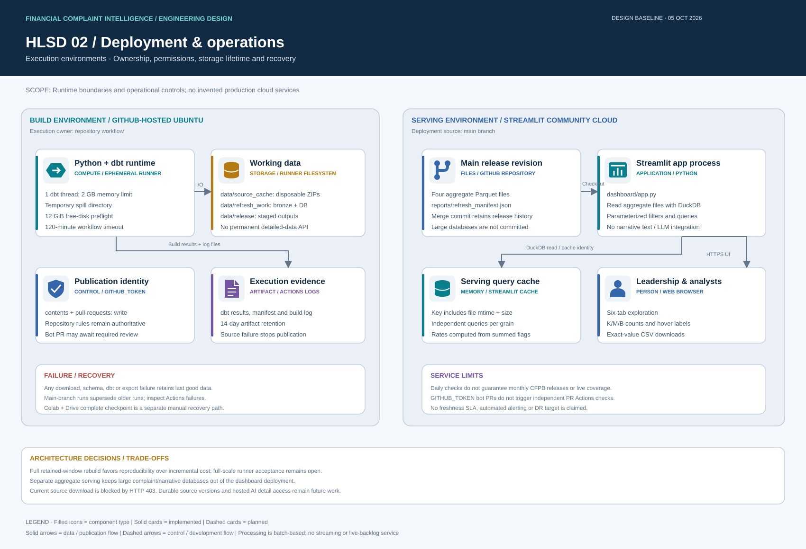

# High-Level System Design (HLSD)

> **Refresh enabled; updates may fail (2026-10-05):** CFPB HTTP 403 errors may prevent downloads. Scheduled runs remain active; failed attempts preserve the last validated snapshot. See [refresh operation](../docs/automated-refresh.md).

The system prepares public CFPB complaint data for a seven-tab leadership dashboard and a future evidence-backed AI agent. The scheduled refresh implementation is intended to replace manual dataset uploads after its first successful full-data publication; Colab remains the interactive development and recovery environment.

[Editable draw.io architecture](../assets/diagrams/system-architecture.drawio) · [Refresh operation guide](automated-refresh.md) · [Low-Level Design](LLD.md)

## View catalogue

| Draw.io page | Audience | Design questions |
|---|---|---|
| HLSD 01 — Platform architecture | Leadership and architects | What are the source, system boundaries, processing and consumption responsibilities? |
| HLSD 02 — Deployment & operations | Platform engineers and operators | Where does each component execute, what persists, and what limits publication? |

The architecture separates external source ownership, ephemeral batch compute, versioned releases, public dashboard serving and future AI. Technologies and relationship labels are explicit. Filled icons identify component types; dashed planned boundaries do not imply deployed capabilities. See [design guidance and review criteria](design-guidelines.md).

## Requirements and nonfunctional design

| Concern | Current requirement / design | Acceptance or limitation |
|---|---|---|
| Business scope | Complaint trends, concentrations, response outcomes and narrative availability | Seven dashboard tabs including sampled local NLP themes; no inferred internal root causes |
| Data lifecycle | Latest archive-labelled 36 calendar months by received date | Not yet applied to serving data; first full rolling release blocked |
| Correctness | Complaint grain and shared additive metric definitions | dbt tests plus four-export sum reconciliation |
| Reliability | Stage and validate before PR-based release | Last published revision survives failed processing or blocked merge |
| Security | Official HTTPS sources; scoped workflow write permissions | No Drive credentials; repository permissions govern release writes |
| Performance | Chunked ingestion; separate compact serving aggregates | Runner and Streamlit limits apply; no measured latency target is claimed |
| Recovery | Git history for serving releases; separate manual Drive checkpoint | No automated disaster-recovery or RPO/RTO commitment |
| Freshness | Daily source check at 11:23 UTC | Source timing and scheduler delays prevent a freshness SLA |

## Architecture decisions

| Decision | Reason | Trade-off |
|---|---|---|
| Full retained-window rebuild | Replays changed sources and models with deterministic complaint identity | Greater runtime and disk use than incremental ingestion |
| DuckDB + dbt batch processing | Reviewable SQL, tests and a low-service-count development path | Temporary runner DB cannot serve a persistent AI query endpoint |
| Wide and star gold in parallel | Reuse metric definitions and support future representation evaluation | Star depends on wide gold; not independent metric calculation |
| Four serving grains | Keep leadership queries compact without aggregate join multiplication | No row-level complaint text in serving files |
| Branch → PR → merge commit | Preserve review and publication history | Required repository rules may leave release PRs pending |

## Components and current status

| Component | Responsibility | Status |
|---|---|---|
| CFPB archive discovery | Find official ZIPs and their labelled month coverage | Live catalog discovery verified |
| GitHub Actions refresh | Daily check, manual force run, source caching and full retained-window rebuild | Implemented and enabled; HTTP 403 may block downloads |
| DuckDB + dbt | Bronze identity, typed staging, eight silver tables, wide gold and parallel star schema | Implemented; 21 models and 126 tests pass on synthetic refresh fixtures |
| Publication gate | Reconcile four datasets, create release branch, PR and merge commit | Implemented; merge depends on repository permissions and branch rules |
| Streamlit Community Cloud | Serve filters, charts, comparisons and downloads | Live seven-tab dashboard |
| Colab + Drive | Interactive work and manually saved full-data recovery checkpoints | Existing development workflow |
| SQL agent + narrative retrieval + LLM | Compute answers and cite supporting complaint records | Planned; no deployed AI agent |

## Refresh lifecycle

The scheduler checks at 11:23 UTC daily, or on an authorized manual run. Official archive URLs, byte hashes, retention boundaries and transformation code determine a release revision. Conditional HTTP requests reuse verified ZIPs where supported. Unchanged revisions skip the build and publication.

A changed revision starts from a fresh retained-window database. The first implementation performs a complete rebuild, not incremental warehouse merges. Provenance survives ingestion. Overlapping complaint IDs resolve by higher numeric source release priority. dbt materializes staging, silver, wide gold and star models and runs the data tests. Four independent aggregate grains are then exported and their additive flags reconciled to wide gold.

All serving files and the source manifest form one release commit on an automated branch. A PR records validation and is merged using a merge commit when repository rules permit. Failed processing or a blocked PR merge preserves the last published serving files. New main-branch refresh runs supersede older runs. No implementation or data release should push directly to main.

## Rolling retention

The active window covers 36 calendar months ending in the latest archive-labelled month. August 2026 gives `[2023-09-01, 2026-09-01)`; September advances it to `[2023-10-01, 2026-10-01)`. Complaint **received date** controls retention. Expired records are absent from the newly built silver, gold, star and dashboard aggregates. Source caches, Git history and existing Drive backups are distinct from active serving retention.

The initial dashboard still represents the historical November 2022–August 2026 dataset until the first full rolling release passes. Archive labels and measured file dates are different evidence; the publication manifest records observed coverage, and a label alone does not prove a complete latest month.

## Dashboard and serving boundary

| Tab | Main questions | Dataset |
|---|---|---|
| Overview | Volume, coverage and leading concentrations | Daily company/product |
| Trends | Time patterns and equal-length previous-period change | Daily company/product |
| Companies | Company volume share and recorded response rates | Daily company/product |
| Products & Issues | Product treemap and issue/sub-issue drilldown | Daily company/product + issue aggregate |
| Response Outcomes | Timeliness and recorded relief/outcome mix | Daily company/product |
| Geography & Channels | State patterns and submission-channel volume | State + channel aggregates |

Date, company, product and sub-product filters apply across tabs. Local issue selection affects only its drilldown charts. The files are queried separately: joining different aggregate grains would multiply complaints. Cache keys include dataset file identity. The manifest adds last validated refresh and observed coverage. Display values use K/M/B while CSVs retain exact counts.

## Planned AI boundary

The AI agent will combine constrained read-only SQL with filtered narrative retrieval and an LLM. Numerical answers must come from executed calculations; narrative explanations must cite supporting complaint IDs. Detailed-data hosting, model/provider, retrieval index and evaluations are not yet implemented. The aggregate dashboard files do not contain narrative text and cannot alone support that evidence layer.

## Operations and limitations

GitHub stores code, designs and compact serving releases. Source ZIP caches are disposable; the runner's bronze and full DuckDB files are temporary. Build evidence artifacts have 14-day retention. Durable source-version storage and permanent detailed-data serving are future work. Drive backups remain untouched.

Repository permissions must permit bot PR creation. GITHUB_TOKEN-created PRs do not trigger independent Actions CI; the refresh job validates before creating them. Required checks/reviews can leave a release PR pending. GitHub schedules may be delayed or disabled after 60 days without repository activity. CFPB release timing is outside this system's control. Source/schema changes fail closed. The dashboard is a public complaint snapshot, not a live operational backlog or an incident-rate comparison adjusted for company size.

Current full-run blocker (2026-10-05): GitHub-hosted execution successfully discovered the archive catalogue and passed synthetic dbt validation, but its first source ZIP request returned HTTP 403. No refreshed datasets were published. Unattended full-data ingestion requires an allowed download path or execution environment; it is not yet operational. Existing dashboard datasets remain unchanged.

## Implemented narrative analysis boundary

Complaint Insights adds local TF–IDF/NMF theme discovery over filtered sampled excerpts, with evidence IDs, support counts and coverage limitations. A fifth serving Parquet is hash-bound to the overview snapshot and published in the same release PR. This is unsupervised NLP, distinct from the planned SQL/retrieval/LLM agent. See [detailed analysis contract](complaint-insights.md).
