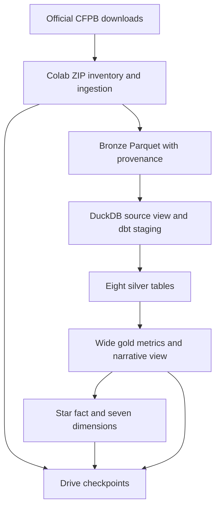
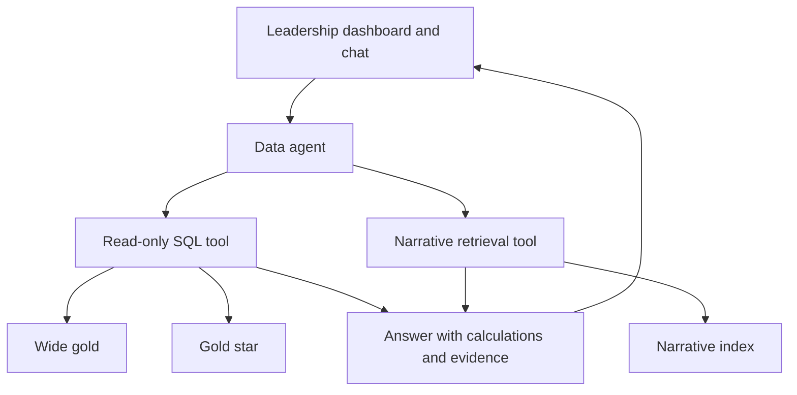

# High-Level System Design (HLSD)

**Design view:** implemented data foundation and planned executive intelligence, with explicit component boundaries.

[Open the full-size diagram](../assets/diagrams/system-architecture.svg) · [Project walkthrough](project-walkthrough.md) · [Metric definitions](metric-definitions.md)

---

## Design summary

| Decision | Implementation | Why it matters |
|---|---|---|
| Remote compute | Colab | Supports an iPad development workflow |
| Transformation engine | DuckDB + dbt | Repeatable SQL with explicit quality gates |
| Data architecture | Bronze → silver → gold | Preserves inputs and separates readiness levels |
| Gold representation | Wide + additional star | Enables controlled agent query comparisons |
| AI interaction | Planned SQL + narrative tools | Connects numerical answers to evidence |
| Hosting boundary | Permanent hosting undecided | Avoids presenting development backups as serving infrastructure |

## Goal and scope
Provide leadership with consistent complaint analytics and an evidence-backed data agent. The implemented scope is the batch data foundation; serving and AI are planned.

## Implemented processing

View the editable Mermaid definition

Colab supplies remote compute for an iPad-based workflow. DuckDB stores transformed tables. dbt manages dependencies, transformations and assertions. Checkpoints persist files and the closed database after successful stages. They are development backups, not an application-serving design.

## Planned serving and AI

View the editable Mermaid definition

The agent will choose date grouping and filters under documented metric definitions. SQL calculates quantities; retrieval supplies relevant complaint text. The LLM must not fabricate figures or establish internal root causes from narratives. Model/provider, permanent data hosting, vector index and dashboard hosting have not been selected or provisioned.

## Boundaries
Repository: code, designs and result summaries. Data plane: source archives, bronze files and the DuckDB dataset. Serving plane: planned dashboard, agent and retrieval service. Secrets remain outside the public repository. AI query access will be read-only with schema allowlists, query limits and logged tool outcomes.

## Acceptance goals
Preserve all selected complaints; reconcile both gold structures; reproduce builds from available bronze; support variable date aggregation; cite evidence in narrative answers. Exact AI performance targets will be set before evaluation, not claimed here.

## Current operating limitations
Manual source downloads; full table rebuilds; source availability not continuously monitored; local bronze paths embedded in the source view need rebinding after runtime reset. No orchestration scheduler, hosted endpoint, SLA or production monitoring is implemented.
