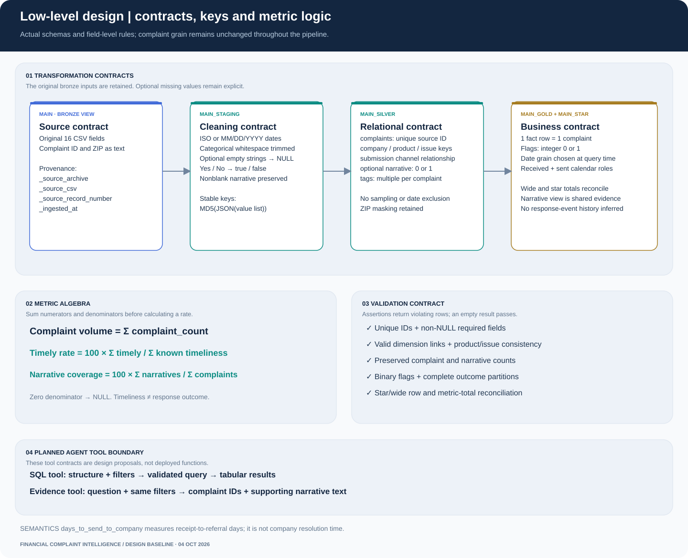

# Low-Level Design (LLD)

**Engineering view:** automated source discovery, rolling retention, physical schemas, export contracts and PR-based publication.

[Download editable draw.io file](../assets/diagrams/low-level-contracts.drawio) · [Open the full-size diagram](../assets/diagrams/low-level-contracts.svg) · [Project walkthrough](project-walkthrough.md) · [Metric definitions](metric-definitions.md)

---

## Engineering invariants

| Invariant | Design rule | Validation |
|---|---|---|
| Complaint grain | One source complaint per fact row | Unique ID + row-preservation tests |
| Identity | Source ID as text; JSON-based category keys | Key uniqueness + relationship tests |
| Missingness | Optional blanks become NULL | Required-field and outcome-partition tests |
| Metrics | Additive 0/1 flags; aggregate before division | Binary and consistency tests |
| Time | Received date default; Monday weeks; two calendar roles | Date key relationships + ISO-boundary smoke assertion |
| Evidence | Preserve nonblank narrative text | Narrative-count preservation |
| Parallel gold | Identical metric definitions in wide and star | Row and every-flag total reconciliation |

## Physical schemas
| Schema | Objects |
|---|---|
| `main` | `bronze_complaints` view over selected Parquet parts |
| `main_staging` | cleaned complaint view, keyed view and split-tag view |
| `main_silver` | eight materialized relational tables |
| `main_gold` | materialized `complaint_metrics`, narrative search view |
| `main_star` | materialized fact and seven dimensions |

Names follow dbt's default `<profile_schema>_<custom_schema>` behavior. The development profile starts at `main`.

## Ingestion contract
Historical Colab ingestion: read selected ZIP CSV members in 50,000-row pandas chunks with string types and `keep_default_na=False`. Preserve original 16 fields, write Zstandard Parquet, and add `_source_archive`, `_source_csv`, `_source_record_number` and `_ingested_at`. Record numbers are logical CSV records, not physical lines. Count written Parquet rows against read rows. `_SUCCESS.json` markers support completed-source reuse in the same output folder but do not validate a changed source checksum. Partial parts are removed on retry for an unfinished source.

## Staging contract
Trim ordinary categorical fields and translate empty strings to NULL. Keep complaint ID and ZIP as text. Parse received/sent dates as ISO dates or `%m/%d/%Y`. Map `Yes`/`No` timeliness to booleans. Preserve nonempty narrative text verbatim; whitespace-only text becomes NULL. Staging itself adds no date or complaint filters. In the scheduled workflow, received-date retention and complaint-ID overlap resolution have already occurred in bronze. Staging preserves raw sent-date and timeliness strings for diagnosis.

## Keys and cardinality
Complaint ID is the verified unique source key. Category keys use MD5 over JSON-encoded value lists; JSON preserves component boundaries and NULLs. Keys are stable for unchanged labels but are not enterprise master-data identifiers. Uniqueness tests catch observed collisions or inconsistencies.

Product key: product + sub-product. Issue key: product + sub-product + issue + sub-issue. Geography key: state + ZIP. Response key: outcome + public response category + timeliness string. Blank optional labels remain NULL attributes while category combination keys remain populated.

Silver tags split on commas, trim and deduplicate complaint/tag pairs. In the historical full snapshot, two tags produced 484,025 relationships; joining this bridge before aggregation can multiply complaints. Use EXISTS filters or deduplicate complaint IDs when filtering tags.

## Gold designs
Wide gold joins silver dimensions with LEFT JOINs and retains one row per complaint plus integer metric flags. The narrative view joins complaint context to available narratives. It is not a vector index.

The additional star schema reads the existing wide model and preserves its flags exactly. Date keys are integer YYYYMMDD. A continuous calendar spans received and sent dates. Date is role-playing: received and sent keys point to the same calendar. ISO year and ISO week must be used together; week starts Monday. Gold issue dimension has product context as attributes but no product-dimension FK.

## Tests
SQL/YAML tests verify unique/non-null keys, required fields, dimension relationships, row preservation, narrative preservation, unique tag pairs, product/issue consistency, binary flags, flag partitions and star/wide metric reconciliation. These are dbt assertions; DuckDB tables are not declared with enforced SQL primary-key/foreign-key constraints. Tests must run after transformations.

## Planned agent tool contracts
`query_metrics(question, structure, filters)` will select either wide or star schema, execute validated read-only SQL with row/time limits, and return columns, rows, query and metric context. `search_narratives(query, filters)` will retrieve complaint IDs, source context and supporting text. These are proposed contracts, not implemented functions.

Cross-tool date/company filters must match. Answers should identify snapshot coverage and distinguish counts, response categories and narrative findings. Both structures will be evaluated against identical question definitions and ground-truth SQL.

## Recovery and portability
Use `scripts/bootstrap_bronze.py` to bind available Parquet to `main.bronze_complaints`; close other database connections before dbt starts. Profiles use environment-configurable paths. Colab notebook generators still contain the original Colab/Drive paths. Drive-mounted sources must be mounted again after restart. A database backup is copied after connections close; large data stays outside GitHub.

## Scheduled ingestion and release contracts

`scripts/refresh_pipeline.py` collects only HTTPS archives on the official CFPB hosts. It recognizes numbered archive filenames and their labelled month ranges, selects all sources overlapping the latest 36-month window, and rejects missing catalogue months. ZIP downloads stream to temporary files and are renamed only after completion; cached files are verified with SHA-256. ETag or Last-Modified conditional requests depend on the source server honoring its validator contract. Changed revisions include source content hashes, boundaries and maintained transformation code.

CSV parsing uses string fields and 50,000-row chunks. Required columns, parseable received dates and nonempty complaint IDs are mandatory. Retention is the half-open received-date interval `[window_start, window_end_exclusive)`. Original logical record numbers are preserved before filtering. `_source_priority` is internal ingestion metadata; overlap resolution uses `row_number()` partitioned by trimmed complaint ID, ordered by source release number descending and source record number descending. Bronze contains the winning original fields and provenance, without `_source_priority`. This precedence is a deterministic archive-release rule, not an independent record-level update timestamp.

The runner builds a new DuckDB database and executes the entire maintained dbt project. Threads are one, dbt memory limit is 2 GB, and spilling uses a temporary runner directory. At least 12 GiB free disk is required; the workflow timeout is 120 minutes. Scheduled profiles are isolated under `data/refresh_work/profiles`; private runtime profiles remain untracked.

## Four serving grains

All files group by received date, company identity/name, and product category identity/product/sub-product. The extra grouping dimensions are:

| File at repository root | Additional dimensions |
|---|---|
| `dashboard_daily_company_product.parquet` | None |
| `dashboard_issues.parquet` | Issue + sub-issue |
| `dashboard_geography.parquet` | State |
| `dashboard_channels.parquet` | Submission channel |

Each export sums all 18 existing `*_count` flags and retains NULL category groups. Its flag totals must exactly equal the gold totals. A 90 MiB file-size guard blocks oversized serving releases. Export files are not joined to one another. Rate denominators and unknown values remain those defined in [metric definitions](metric-definitions.md).

`reports/refresh_manifest.json` contains revision SHA-256, source URLs/content hashes/HTTP validators, retention boundaries, observed minimum/maximum received dates, complaint total, all flag totals, export hashes/sizes, overlap count and validation timestamp. Only successful releases update this manifest. The dashboard's cached query function takes `(mtime_ns, file_size)` as an explicit cache argument, preventing unchanged query text from reusing values after checkout updates its source file.

## Publication and failure behavior

The workflow stages exports in `data/release`. After all tests pass, it creates `automated/data-refresh-<run-id>`, commits the four serving files plus manifest, opens a PR and attempts a normal merge commit. It does not bypass protected-branch checks. Failed download/parse/build/reconciliation/merge means no replacement of the current main-branch serving data. An unchanged revision produces no new release. Independent PR Actions checks are not triggered by GITHUB_TOKEN events; release-job validation runs before the PR. Repository policy may require a reviewer or separate credential configuration for independent bot PR CI.

Large temporary bronze and DuckDB data are not uploaded. Build logs/results/manifest are retained as workflow evidence for 14 days; source caching is not a durable archive. Existing Colab backups and historical full-snapshot documentation are preserved. The first complete scheduled publication remains a distinct acceptance check from synthetic fixture validation.

Current full-run blocker (2026-10-05): GitHub-hosted execution successfully discovered the archive catalogue and passed synthetic dbt validation, but its first source ZIP request returned HTTP 403. No refreshed datasets were published. Unattended full-data ingestion requires an allowed download path or execution environment; it is not yet operational. Existing dashboard datasets remain unchanged.
