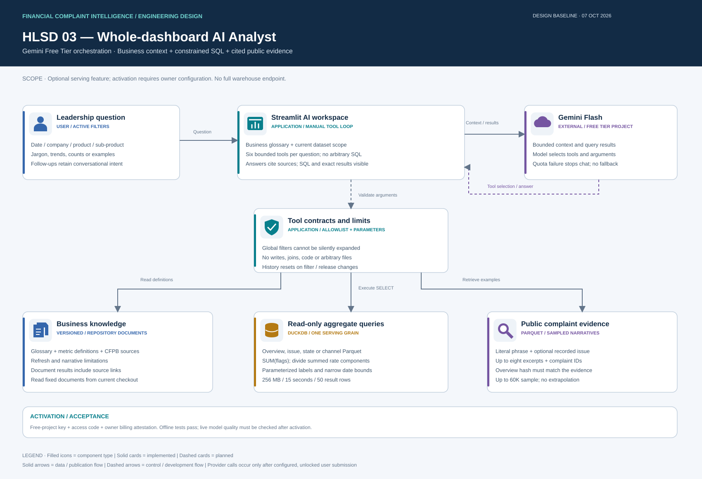

# AI Analyst: whole-dashboard chatbot

The eighth dashboard tab is an optional Gemini-powered business analyst. It answers questions across all serving datasets, explains business terminology and source context, runs constrained read-only SQL, and retrieves sampled public narrative evidence. It is implemented but requires owner configuration before live model answers are available. No API key is stored in the repository.

## Activate without paid API usage

1. Open [Google AI Studio API keys](https://aistudio.google.com/api-keys), sign in and create a key in a **Free Tier project with no linked billing account**. An API key inherits its project's billing tier; a free-eligible model alone does not prevent charges when used with a paid project.
2. In Streamlit Community Cloud, open the deployed app's **Settings → Secrets** and add:

```toml
GEMINI_API_KEY = "paste-your-private-free-tier-key-here"
GEMINI_MODEL = "gemini-3.5-flash-lite"
AI_FREE_TIER_CONFIRMED = true
AI_ACCESS_CODE = "choose-a-long-private-workspace-code"
```

3. Save, open **AI Analyst**, enter your workspace code and submit a small test question. Keep both secrets out of chat, GitHub and notebooks. For local development, use an ignored `.streamlit/secrets.toml` or equivalent environment variables.
4. Confirm project billing remains unlinked in AI Studio. Do not enable billing or use a paid-project key if the goal is zero API spend.

`AI_FREE_TIER_CONFIRMED` is an owner attestation, not an API billing check. The application cannot determine a key's actual project billing status. It defaults to `gemini-3.5-flash-lite` and also supports `gemini-3.1-flash-lite`. Legacy `gemini-2.5-flash` and `gemini-2.5-flash-lite` remain selectable for projects with existing access, has no paid-provider fallback, and stops on quota/service errors. Google can change model availability, quotas and terms. Free capacity is not an always-on SLA.

Official references: [pricing](https://ai.google.dev/gemini-api/docs/pricing), [billing](https://ai.google.dev/gemini-api/docs/billing), [rate limits](https://ai.google.dev/gemini-api/docs/rate-limits), [function calling](https://ai.google.dev/gemini-api/docs/function-calling), [Python SDK](https://github.com/googleapis/python-genai).



[Editable draw.io design](../assets/diagrams/ai-analyst.drawio).

## Knowledge and tools

| Tool | Purpose | Contract |
|---|---|---|
| `inspect_datasets` | Discover coverage, grains, available metrics and active filters | Reads snapshot date bounds; describes current serving schemas |
| `read_business_document` | Explain jargon, formulas, provenance, refresh and narrative limits | Fixed allowlist of repository documents; no arbitrary file access |
| `query_metrics` | Execute numerical analysis across overview, issues, geography or channels | Typed metric/dimension arguments → application-generated parameterized SELECT SQL |
| `search_narratives` | Find public complaint examples | Literal phrase + optional exact issue, active filters, up to eight sample excerpts |

The system prompt includes [business-glossary.md](business-glossary.md). The model can read [metric-definitions.md](metric-definitions.md), [data-sources.md](data-sources.md), [complaint-insights.md](complaint-insights.md) and [automated-refresh.md](automated-refresh.md) as needed. Documents are loaded from the current checkout; definitions are not embedded as an unmaintained external vector index. Actual schema/metric allowlists are in `dashboard/agent_tools.py`.

The model chooses tools and arguments. The application constructs SQL using allowlisted dimensions and formulas and bound label/date parameters. It accepts no raw SQL, Python, shell command, URL, path or arbitrary query expression from the model. Grains cannot be joined. Each query executes in a disposable in-memory DuckDB connection against one known Parquet, with 256 MB memory, one thread and a 15-second interrupt timer. Returned aggregate rows are capped at 50 and truncation is reported. Queries use `SUM(complaint_count)` rather than counting aggregate rows. Rates divide summed flags and return NULL for zero denominators.

All queries inherit global received-date, company, product and sub-product filters. Additional filters/date bounds narrow this scope. Out-of-scope dates are rejected. Local chart drilldowns do not apply to chat. Conversations reset when filters, serving-file identities or knowledge content change. Follow-up history conveys conversational intent; current facts must be queried again.

## Answer and evidence contract

Answers contain concise sections with successful source IDs such as `S1`. The source panel includes actual SQL, bound parameters, exact result tables, document links and complaint IDs. A downloadable JSON contains the answer and supporting tool results. Narrative IDs come from the sampled export; a hash mismatch disables evidence search. Text is further masked for common email/link/long-number patterns; this is not complete anonymization.

Gemini receives the question, up to six recent conversational messages, business context and bounded tool results. It does not receive the entire DuckDB checkpoint or complete Parquet files. Tools treat customer text as untrusted data. The model is instructed to cite numerical results, distinguish allegations from verified facts, state denominators, use K/M/B display notation and avoid unsupported causal, sentiment, financial-loss or resolution-duration claims. Citation validation rejects missing/unknown source IDs. It does **not** prove every sentence is factually entailed; human review and live model evaluation remain necessary.

The overview, issue, state and channel exports contain full aggregate metrics. The narrative export contains up to 60K sampled first-2K-character excerpts. Full complaint-level warehouse queries, semantic/vector retrieval and arbitrary cross-grain combinations (e.g. issue by state) are not connected. Public counts lack customer/market-share denominators. Financial-loss amounts, internal root causes and resolution duration cannot be answered from these files.

## Limits and failure behavior

- At most six tools and seven generation requests per question; a question may consume several API quota units.
- 1,000-character question, bounded dimensions/metrics, 50 aggregate rows, eight narrative excerpts and 20K characters per business document.
- Twenty questions per session, ten-second submission cooldown and sixty questions per deployment process per rolling hour. These reset with process/session lifecycle and are not durable account-wide quota controls.
- SDK automatic tool execution/retries are disabled. Each API request has a 20-second timeout; orchestration checks a 120-second budget between requests.
- Workspace access code controls shared access to this optional feature; it is not individual authentication. The public charts remain accessible.
- Missing key/code/free-tier confirmation disables chat without contacting Gemini. Quota, network, model, validation or provider failures withhold the answer and preserve the dashboard. Provider error text and credentials are never displayed.

Google's Free Tier may use supplied content to improve products, as stated in its pricing/terms. Send only the bounded public snapshot content for this project; users should not submit confidential company information.

## Validation and acceptance

Run `python scripts/test_ai_agent.py --app`. Offline evaluations execute real DuckDB calculations and test weighted-rate accounting, zero denominators, global/date narrowing, NULL labels, injection-resistant parameters, grain isolation, ranking truncation, missing evidence releases, limited masking, unsupported tools, real Gemini SDK message/schema construction, source-ID validation, configuration/access-code gating and filter-driven history reset. All four current aggregate totals are checked against the overview.

No real model call is made by CI, and mocked responses do not establish live model accuracy. After key activation, acceptance should cover: top companies with timeliness support, monthly demand, issue ranking, state and channel queries separately, relief definitions, CFPB provenance, cited narrative examples, follow-ups, unsupported loss/duration requests, filter changes and quota errors. Compare numerical answers with displayed SQL results. Record observed quality/latency before claiming production readiness.

### Service diagnostics

The workspace displays a safe diagnostic instead of a generic configuration warning: `AI-KEY-BLOCKED` or `AI-KEY-INVALID` for rejected keys, `AI-PERMISSION` for access restrictions, `AI-QUOTA` for rate/quota limits, `AI-MODEL` for unavailable models, `AI-REQUEST` for request format errors, and `AI-TIMEOUT`, `AI-CONNECTION` or `AI-SERVICE` for connectivity/service failures. `AI-ELIGIBILITY` indicates an account prerequisite and `AI-INTERNAL` indicates an application/SDK failure. Share only the displayed diagnostic when requesting support. Provider payloads, exception messages and credentials are never shown. No billing upgrade or paid fallback is automatic.

### Migrating a new project from Gemini 2.5

Google limits Gemini 2.5 models to projects that actively used them previously. New projects should use the current Flash-Lite model. If `AI-MODEL` appears with a 2.5 configuration, replace just the model line in Streamlit secrets with `GEMINI_MODEL = "gemini-3.5-flash-lite"` and save. The explicit secret overrides the code default, so a deployment alone does not change it. Keep the key, workspace phrase and free-tier confirmation in place.

Gemini 3 requests use `thinking_level="minimal"`; legacy 2.5 requests retain `thinking_budget=0`. Full model contents, including thought signatures, are preserved between tool turns. No automatic model fallback occurs.

Official references: [Gemini model lifecycle](https://ai.google.dev/gemini-api/docs/deprecations), [Flash-Lite capabilities](https://ai.google.dev/gemini-api/docs/models/gemini-3.5-flash-lite), [API pricing](https://ai.google.dev/gemini-api/docs/pricing). Model access and free-tier capacity still depend on the project.
