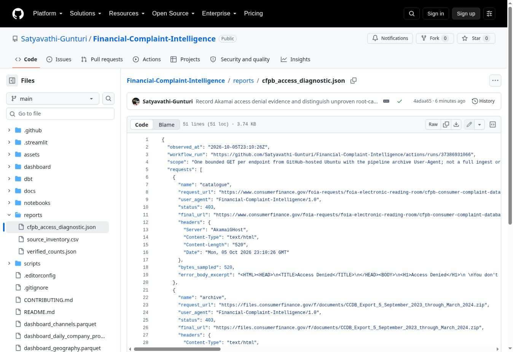

# Automated rolling data refresh

The live Colab notebook `01_CFPB_Data_Exploration.ipynb` was read on 2026-10-05. Its recovery, complete database checkpoint and four export cells inform this pipeline. The notebook remains the interactive historical workflow; maintained dbt models and `scripts/refresh_pipeline.py` are the scheduled implementation.

## Schedule and activation

**ON HOLD as of 2026-10-05.** Scheduled and push triggers have been removed from `.github/workflows/data-refresh.yml`, and the refresh job has an explicit false condition, so manual dispatch cannot ingest or publish while the hold remains. The current dashboard snapshot is preserved. The access diagnostic workflow is manual-only; it does not refresh data.

The intended cadence after resumption is daily at **11:23 UTC** (06:23 Central daylight time; 05:23 Central standard time). Resumption requires verified CFPB access, an explicit decision to lift the hold, and a reviewed PR that removes the job hold and restores the intended triggers. The error disappearing does not automatically re-enable the pipeline. No Drive credentials or LLM/API subscription is used by the existing archive implementation. Repository rules still govern publication.



## Publication contract

1. Discover official HTTPS CFPB archive links and parse their labelled month coverage; fail on unknown formats or missing months.
2. Anchor the 36-month window to the latest archive-labelled month, not the computer's current date. August 2026 implies `[2023-09-01, 2026-09-01)`. Archive labels do not independently establish whether their latest month is fully populated.
3. Cache ZIP downloads, use HTTP validators when available, and hash bytes with SHA-256. Re-download if cache identity is uncertain. Source URLs, hashes, window boundaries and transformation code determine revision identity.
4. On a changed revision, rebuild the retained records in a fresh temporary database. Records outside the received-date window are excluded. Existing complaints are not blindly appended; a higher numeric archive release takes precedence for an overlapping complaint ID, with source record order as a deterministic tie-breaker. Report overlap counts. Replaced files with the same name are detected by content changes under the server's validator contract.
5. Build all dbt models and run their data tests. Independently reconcile all additive flag totals for each of four dashboard exports and enforce a 90 MiB per-file serving guard.
6. Stage outputs before copying them into the repository. Commit all four files plus `reports/refresh_manifest.json` on a new `automated/data-refresh-<run-id>` branch, open a pull request and merge with a merge commit. Any earlier failure leaves the published data untouched. A rejected branch push or PR merge stops publication; GitHub Actions logs hold the failure.
7. Streamlit follows repository changes; query cache keys include each file's mtime and size. The UI shows observed coverage and last successful validation. CSV downloads retain exact counts; displayed counts use K/M/B.

## Storage and limits

This first version is a full retained-window rebuild when inputs or transformations change, not an incremental warehouse. ZIP caches are disposable accelerators, not durable historical storage. The full DuckDB database and bronze files live only during the runner job; build evidence is retained as a GitHub Actions artifact for 14 days. The existing Colab/Drive backups remain untouched. Previous dashboard releases remain in Git history; the active serving files exclude expired records. Complete source-byte version retention and persistent detailed-data serving for the AI agent are not implemented.

GitHub hosted runners have finite disk/time. The pipeline requires at least 12 GiB free disk before building and times out after 120 minutes. GitHub schedules may be delayed; public repository schedules can be disabled after 60 days without repository activity. Check Actions for failure/disable status. CFPB does not promise a monthly archive release, so automated checks do not imply live source coverage. A source page or schema change deliberately stops publication for review.

## Validation

`python scripts/test_refresh_pipeline.py` uses synthetic ZIP sources to test calendar rollover, missing archive coverage, boundary-date pruning, overlapping revised records, actual dbt builds and all four export reconciliations. `python scripts/refresh_pipeline.py --check-only` tests live catalog discovery without downloading archives or publishing.

## Run locally

```bash
pip install -r requirements-refresh.txt
python scripts/test_refresh_pipeline.py
python scripts/refresh_pipeline.py --check-only
python scripts/refresh_pipeline.py --force
```

The final command stages a full release in `data/release`; it does not publish by itself. The workflow owns the single-commit publication. Dashboard metrics and expected record counts will change after the first 36-month retention build; the original full-snapshot counts stay documented as historical results.

## Pull request publication

Enable **Allow GitHub Actions to create and approve pull requests** under repository Settings → Actions → General → Workflow permissions if GitHub blocks automated PR creation. The workflow token requests repository contents and pull-request write access. No additional credentials are required. PRs created by GITHUB_TOKEN do not trigger other Actions workflows: the release job performs its own full validation before creating the PR. Required branch checks/review rules remain authoritative; if they block an immediate merge, the PR remains pending and the current serving data is preserved. A separately configured GitHub App or suitable scoped token would be needed to trigger independent PR CI for bot-created releases.


Current full-run blocker (2026-10-05): GitHub-hosted execution successfully discovered the archive catalogue and passed synthetic dbt validation, but its first source ZIP request returned HTTP 403. No refreshed datasets were published. Unattended full-data ingestion requires an allowed download path or execution environment; it is not yet operational. Existing dashboard datasets remain unchanged.

## Access investigation
The bounded GitHub-runner diagnostic reproduced HTTP 403 for the catalogue, first ZIP and official API CSV export. Akamai Access Denied responses identify the delivery/access layer; the exact rejection rule is unknown. See [investigation and preserved evidence](cfpb-access-diagnostics.md). The API also has changed export limits and no longer supplies current narratives, so switching endpoints is not yet a validated solution.
