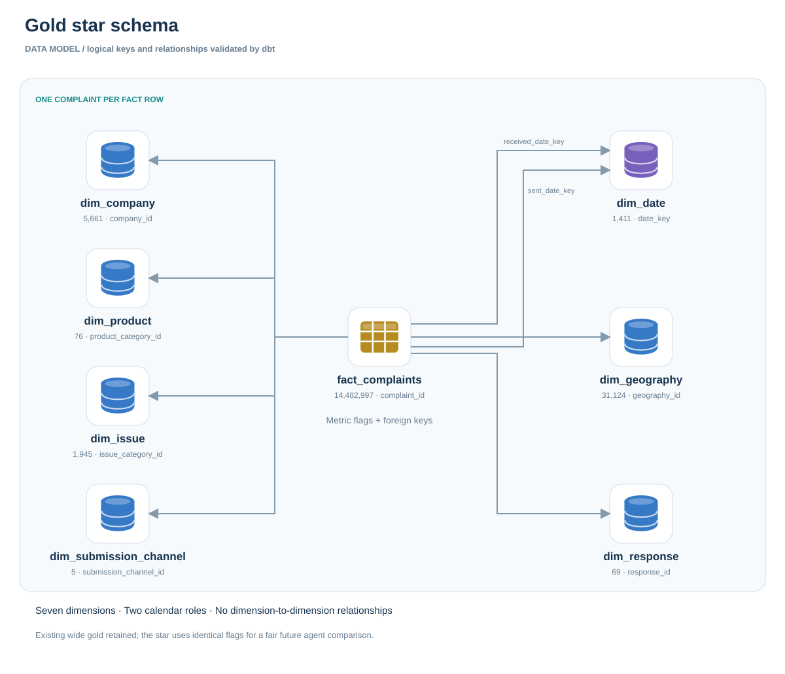
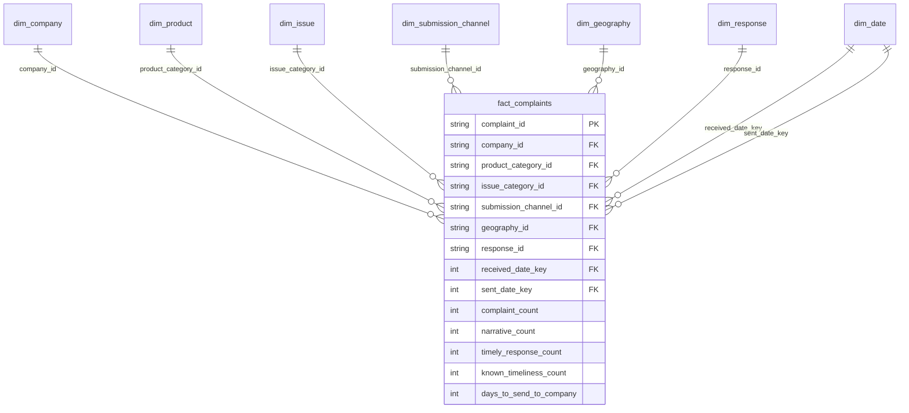

# Gold star schema

**Dimensional view:** fact foreign keys, seven dimensions, two date roles and verified table cardinalities.

[Download editable draw.io file](../assets/diagrams/gold-star-schema.drawio) · [Open the full-size diagram](../assets/diagrams/gold-star-schema.svg) · [Project walkthrough](project-walkthrough.md) · [Metric definitions](metric-definitions.md)

---

Grain: **one complaint per fact row**. Wide gold remains unchanged. The star is an additional gold query structure, with direct fact-to-dimension links and no dimension-to-dimension links.

View the editable Mermaid definition

| Table | Verified rows |
|---|---:|
| fact_complaints | 14,482,997 |
| dim_company | 5,661 |
| dim_product | 76 |
| dim_issue | 1,945 |
| dim_submission_channel | 5 |
| dim_geography | 31,124 |
| dim_response | 69 |
| dim_date | 1,411 |

The date dimension spans both received and sent dates, so its row count is not simply the received-date range. Geography is the reported state/ZIP combination, including masked or missing attributes; it is not a geocoded location. Response represents a distinct combination of recorded categories, not a status-history event.

Narratives and tag relationships remain in the shared supporting silver tables. Agent benchmarks will compare equivalent queries against `main_gold.complaint_metrics` and this star; they have not yet been run.
