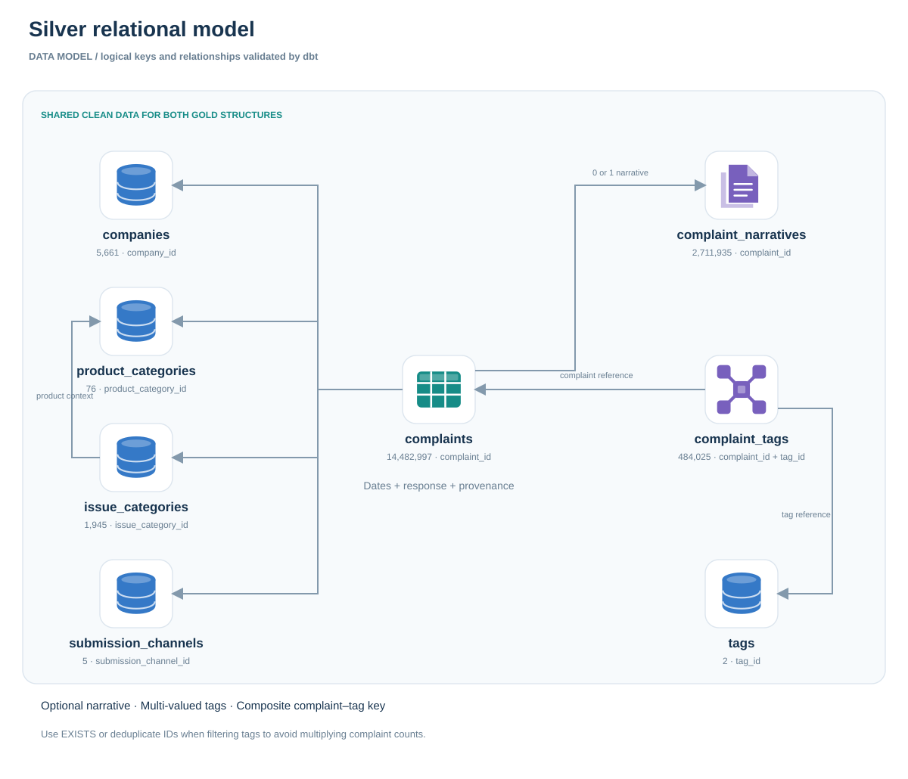
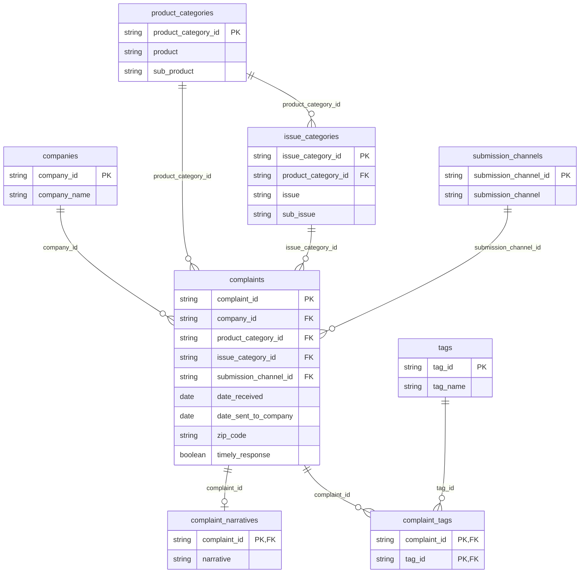

# Silver ER diagram

**Relational view:** normalized complaint records, optional narratives and the many-to-many tag bridge.

[Download editable draw.io file](../assets/diagrams/silver-relational-model.drawio) · [Open the full-size diagram](../assets/diagrams/silver-relational-model.svg) · [Project walkthrough](project-walkthrough.md) · [Metric definitions](metric-definitions.md)

---

These links describe dbt-tested relationships, not enforced DuckDB DDL constraints. One complaint has one company, product combination, issue combination and channel; it may have no narrative or multiple tags.

View the editable Mermaid definition

Complaint–tag pairs form a composite logical key. Complaints also retain state, response categories, narrative availability and ingestion provenance. The SQL files provide the complete column definitions.
